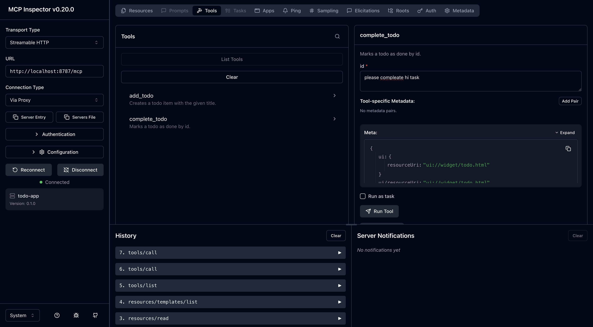
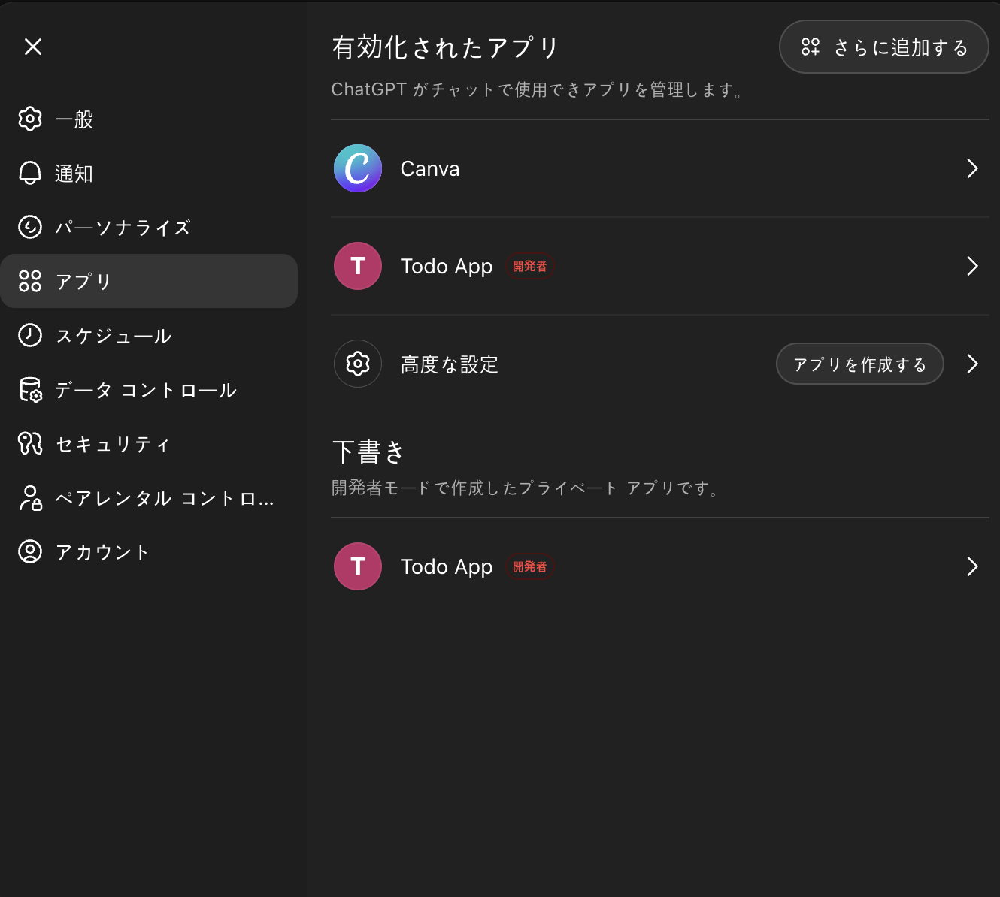
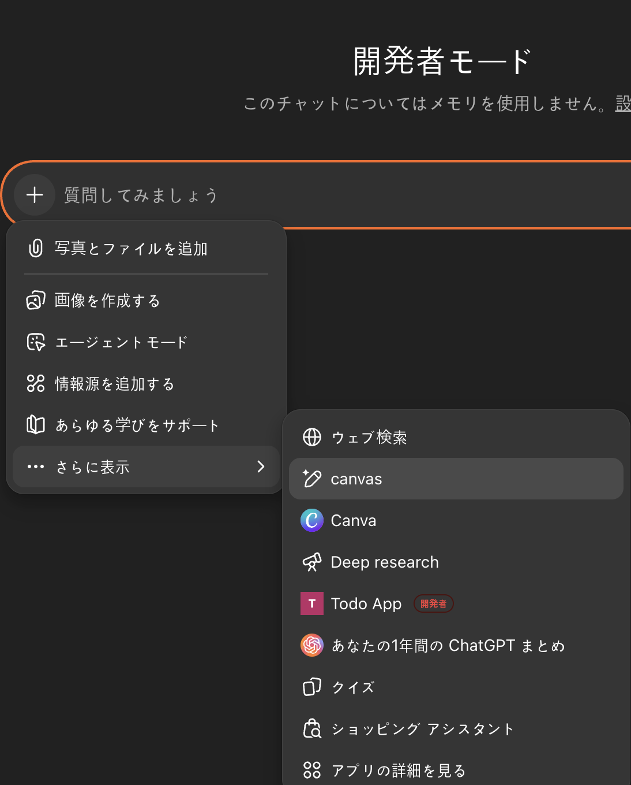
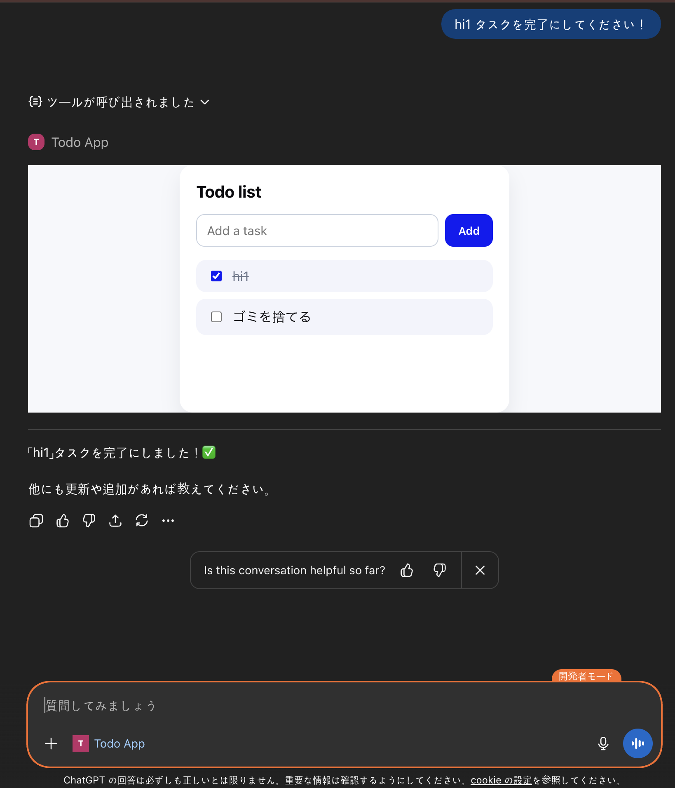

# Chat GPT App SDK サンプルアプリ

## 動かし方

### セットアップ

まず依存関係をインストールします

```bash
npm install
```

次に[ngrok]( https://dashboard.ngrok.com/signup) でサインアップを行います。

サインアップを実施したら[AuthToken](https://dashboard.ngrok.com/get-started/your-authtoken)が発行されるのでそれを使って認証を行います！

ここまでくれば準備OKです！

### 起動

以下でMCP インスペクターを起動させます。

```bash
npx @modelcontextprotocol/inspector@latest --server-url http://localhost:8787/mcp --transport http
```



MCPの動作確認ができたらngrokのURLをChat GPTの開発者画面から設定します。

```bash
ngrok http 8787
```

そして以下の値を設定します。

- アプリの名前
- アプリの説明
- MCPまでのURL
- 認証の有無(検証目的では無しでいいと思います)

そうするとGPTがアプリを認識してくれます！



そしたらMCPを呼び出した時の同じ容量で操作ができます！

違うのはUIがある点です




